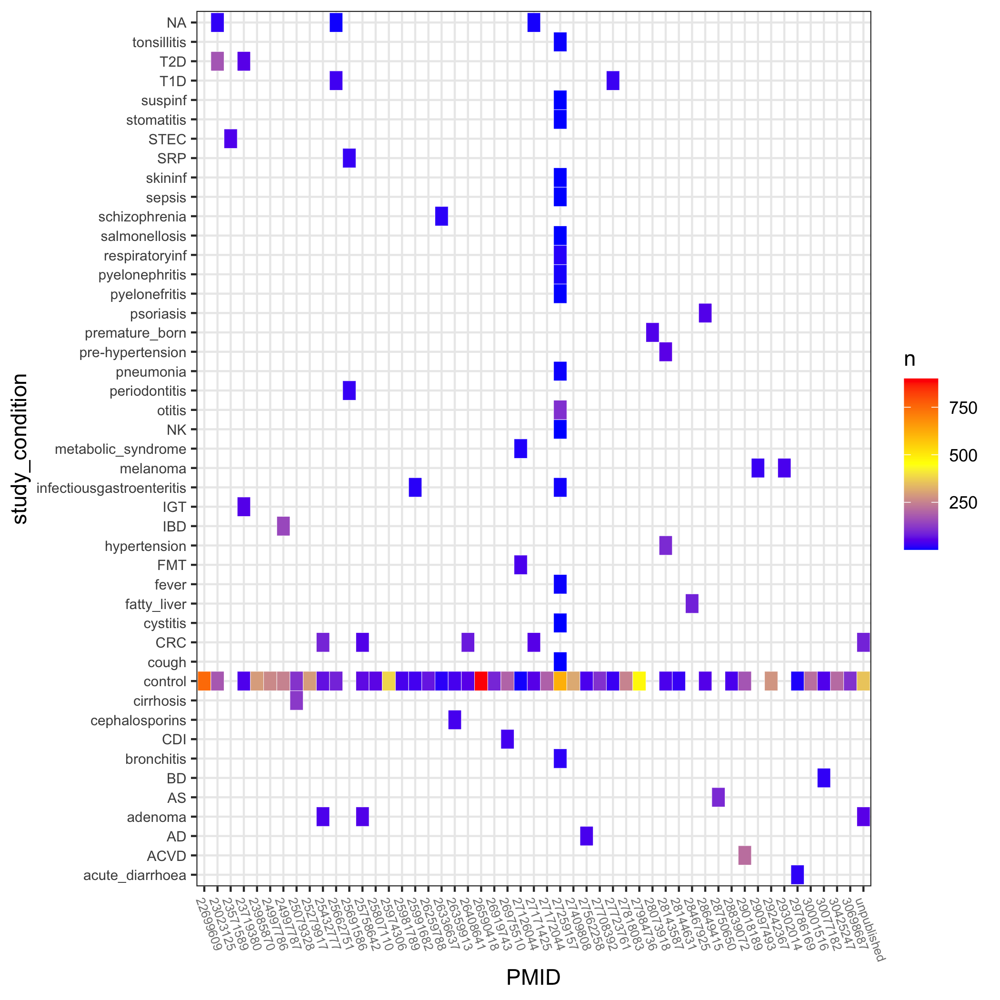

# cMDeda: Exploratory Data Analysis of curatedMetagenomicData

The BioConductor package `curatedMetagenomicData` is a valuable resource to researchers interested in microbial interactions with conditions such as colorectal cancer, diabeties and inflamatory bowel disease. Here, I have vizualized select metadata available in this package in order to quickly subset samples relevant to the user of interest.  

Below, I show an example of a visualization of the metadata contained in curatedMetagenomicData. This heatmap shows `study_condition` on the y-axis and PubMed ID (PMID) on the x-axis. The color scale on the right shows number of samples (n) with the given `study_condition` and `PMID` for ease of study choice. If this type of visualization is useful to you, check out the `results/` folder for more figures showing various other metadata including age, country. I can produce more plots if requested, just open up an issue on this github page.

